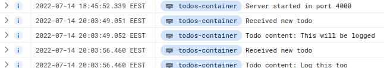
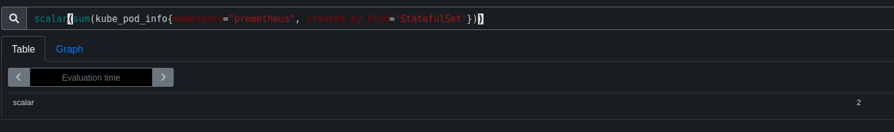

### Devops with Kubernetes 2022

Here lies exercise projects for `Devops with Kubernetes 2022`.

### Exercise 3.6

**DBaaS pros**

* Dedicated support available due to commercial nature.
* Can often be setup with one command or a click of a button.
* Batteries included i.e easier scaling, backuping and monitoring.
* Integrates well with the service providers other products.

**DBaaS cons**

* Money, money, money.
* More prone to vendor locking.
* Less manual control (arguably a pro).

**DIY database setup pros**

* Free and open source.
* Dedicated support is replaced with a (hopefully) large and (hopefully) helpful community.
* No vendor lock.
* Something like postgres is supported by a crazy amount other tooling (hasura, prisma.io, logstash, grafana etc.) .
* Hackable down to the core.

**DIY database setup cons**

* No one is obliged to help you if something goes wrong or doesn't work.
* Harder to setup and easier to mess things up.
* You need to look into backup, scaling and monitoring options yourself. They probably exist but you need to set those up youreslf too.

### Exercise 3.7

I chose postgres because for this project it really made no difference wether to use google cloud sql or postgres.
I already had postgres setup from earlier exercises so setting up gcsql would have been doing the same work.

If the project would greatly benefit from a DBaaS I certainly would have chosen gcsql.
I also have no personal interest in using proprietary software like google cloud sql since postgres has similar DBaaS implementations elsewhere.

I also have familiarity with psql from work and earlier school projects.

### Exercise 3.10

### Exercise 4.3

### Exercise 5.4

Between Red Hat OpenShift and Rancher, OpenShift is the better kubernetes distribution. The reasons are as follows:

* OpenShift comes with builtin support for other development/ops tools such as Apache Kafka. With rancher it is more likely that you are on your own.
* Unlike with for example a database technology, vendor lock is not an issue with kubernetes distributions since anything you can run on a FOSS distribution you can also run on a commercial distribution such as OpenShift.
* Taking into consideration the previous point, a commercial k8s distribution has all the pros of a commercial product (support, ease-of-us, features) and none of the cons (vendor lock) except cost.
* OpenShift comes with meticulous documentation on how to setup a container registry, storage etc. Rancher relies more on the community.
* OpenShift relies on OKD, an open source k8s distribution. This means that OpenShift gets the benefits of a FOSS community with enterpis level support.
* Ultimately I think the choice is dependent on your needs and for most cases any decent k8s distribtion will do.

### Exercise 5.6

* MongoDb: at work
* PostgreSQL: at work and school
* HELM: on this course
* NATS: on this course
* docker-compose: at work and school
* Gradle: at work and school
* OpenApi initiative: at work
* Kaniko: at work
* podman: at work
* argo: on this course
* flux: on this course
* circleci: on my own
* Gitlab: at work
* Jenkins: at work and school
* TravisCI: on my own
* k3s: on this course
* kubernetes: on this course
* etcd: indirectly, used by k8s
* grpc: indirectly, defo used by something i've used
* nginx: at work
* linkerd: on this course
* minio: at work
* containerd: indirectly, used by docker
* flannel: indirectly, used by linkerd apparently
* ansible: at work
* jfrog artifactory: at work
* hashicorp vault: at work
* knative: on this course
* heroku: at school
* prometheus: on this course
* grafana: at work and school
* elasticsearch: at work
* loki: on this course

